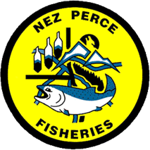

<!-- the following inserts the NPT logo into header and sets a watermark -->
```{=html}
<!-- <script> -->
<!--    $(document).ready(function() { -->
<!--      $head = $('#header'); -->
<!--      $head.prepend('') -->
<!--      $head.prepend('') -->
<!--    }); -->
<!-- </script> -->

<!-- <style> -->
<!-- p.caption { -->
<!--   font-size: 100%; -->
<!-- } -->
<!-- </style> -->



<div class="watermark">DRAFT</div>
```


```{r setup, echo = FALSE, message = FALSE}
# style.css - https://freerangestats.info/blog/2017/09/09/rmarkdown


knitr::opts_chunk$set(
  collapse = TRUE,
  warning = FALSE,
  message = FALSE,
  echo = FALSE,
  comment = "#>",
  fig.path = "../figures/",
  dpi = 600
)

options(knitr.kable.NA = '--')

library(knitr)
#library(kableExtra)
```

# Background
A proposed conservation strategy for sp/sm Chinook salmon is to collect natural-origin parr during the summer months and rear them in a hatchery environment until release as smolts the following spring season. The assumed advantage of this action is the removal of natural rearing mortality during the fall and overwinter period. The aim of this exercise is to calculate the expected survival advantage for hatchery reared natural-origin parr compared to their natural rearing counterparts.

# Methods
First, we assume the number of adults surviving to the tributary from summer parr is the product of three life-stage survival probabilities. The first stage is summer parr surviving to smolt leaving the tributary, in other words, overwinter survival ($\phi_{ow}$). The second stage represents smolt migration survival for fish traveling from the tributary to Lower Granite Dam ($\phi_s$). The third stage is commonly known as a smolt-to-adult return rate (SAR), and here, represents the survival of smolts at Lower Granite Dam (LWG) returning as adults to the tributary ($\phi_{SAR}$). The product of the equation then becomes the survival probability of summer parr returning as adults ($\phi_{parr}$).

$$
\phi_{parr} = \phi_{ow}*\phi_s*\phi_{SAR}
$$
The relative survival advantage ($RSA$) of rearing parr in the hatchery environment then becomes the ratio of parr survival probabilities for fish reared in the hatchery environment ($\phi^{H}_{parr}$) to fish reared naturally in the stream ($\phi^{N}_{parr}$). This concept is similar to the more commonly used relative reproductive success metric often produced from genetic parentage analyses. 

$$
RSA = \frac{\phi^{H}_{parr}}{\phi^{N}_{parr}}
$$
To calculate the ratio we can substitute estimates of the three life-stage survivals for hatchery and natural rearing using our existing data, with one exception. We don't directly monitor natural rearing overwinter survival (i.e., from parr to smolt within the tributary). To indirectly estimate this stage we can use the estimates of natural parr and natural smolts surviving to LWG ($\phi^N_{p}$, $\phi^N_{s}$) from our juvenile PIT-tagging efforts as follows,  

$$
\phi^N_w = \frac{\phi^N_{p}}{\phi^N_{s}}.
$$

Then, after substituting the above calculations and simplifing the full expanded $RSA$ equation becomes,

$$
RSA = \frac{\phi^H_{ow}*\phi^H_s*\phi^H_{SAR}}{\phi^N_p*\phi^N_{SAR}}.
$$
We now can go an additional step in determining the success of the proposed conservation strategy by solving the above equation for $\phi^H_{ow}$. Wee can then set $RSA$ to the management desired minimum that would indicate success of the program and calculate the lowest acceptable hatchery rearing survival that would still yield an RSA above the desired minimum.

$$
MIN(\phi^H_{ow}) =\frac{MIN(RSA)*\phi^N_p*\phi^N_{SAR}}{\phi^H_s*\phi^H_{SAR}}
$$

# Example

```{r functions, echo = FALSE}
calc_rsa <- function(h_ow, h_s, h_sar, n_p, n_sar){
  rsa <- (h_ow * h_s * h_sar)/(n_p * n_sar)
  return(rsa)
}

calc_min_ow <- function(rsa, n_p, n_sar, h_s, h_sar){
  ow <- (rsa * n_p * n_sar) / (h_s * h_sar)
  return(ow)
}
```

```{r example-data, echo = FALSE}
dat <- data.frame(
  'Rearing' = c('Hatchery', 'Hatchery', 'Hatchery', 'Natural','Natural'),
  'Parameter' = c("$\\phi^H_{ow}$", "$\\phi^H_{s}$", "$\\phi^H_{SAR}$", "$\\phi^N_{p}$", "$\\phi^N_{SAR}$"),
  'Value' = c(0.8, 0.6, 0.008, 0.20, 0.01)
)
```


If we assume the parameter values shown in Table \@ref(tab:param-values) the calculated $RSA$ is `r calc_rsa(.8, .6, .008, .2, .01)`. Thus, if 5,000 natural parr were collected and reared in the hatchery environment we would expect approximately `r calc_rsa(.8, .6, .008, .2, .01)` times more adults to return than if the parr reared naturally.

Additionally, if we set $RSA = 1.5$ as a threshold to success, hatchery overwinter survival must be greater than `r calc_min_ow(1.5, .2, .01, .6, .008)` to deem the program successful.


```{r param-values, echo = FALSE, tab.cap='Example parameter values to calculate the relative survival advantage (RSA).'}
#library(tidyverse) 

dat |> #%>%
  kable() #%>%
 # kable_styling(bootstrap_options = 'striped')
  #kableExtra::kable_classic(full_width = T, html_font = "Cambria")
```